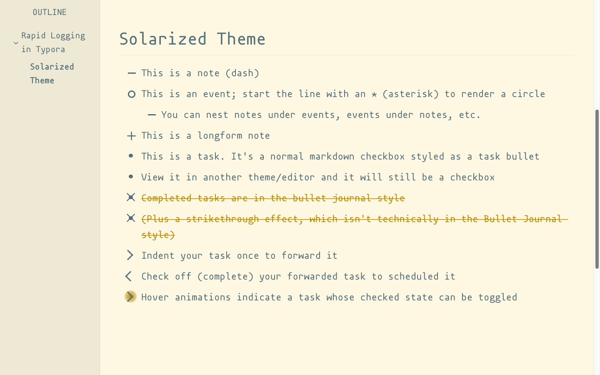

# Typora Rapid Logging

CSS to style unordered lists and task lists (checkboxes) according to the original [Bullet Journal](https://bulletjournal.com/) rapid logging marks.


Created and tested on MacOS 10.14.6 (Mojave)

------------------

## Preview

<details><summary>Solarized</summary>
  
</details>

<details><summary>Solarized Dark</summary>
  
</details>

<details><summary>Mint</summary>
  
</details>

<details><summary>Vue Dark</summary>
  
</details>

### Theme Credits

All credit for these beautiful themes go to their authors:

[[Mint]](https://github.com/Y1chenYao/typora-mint-theme)  [[Lavender]](https://github.com/JARVIS-AI/Typora-Lavender-Theme/)  [[Vue Light/Dark]](https://github.com/blinkfox/typora-vue-theme)  [[Solarized Light/Dark]](https://github.com/belenos/typora-solarized)

And the completed task bullet strikethrough animation was adapted from the awesome theme [Ursine](https://github.com/noatpad/typora-theme-ursine).

----------------

## Project Background
### Why this project

I wanted to Bullet Journal in markdown (for speed, searachability, space) without losing the spirit or simplicity of the analog system. I was wasn't looking for task management or scheduling, I just wanted to make daily logs and rapid log - but in markdown!

Typora's live rendering of markdown is beautiful and functional. I was curious if it could be tweaked for rapid logging with some custom CSS.

<details><summary>Details</summary>


### Unordered Lists in Markdown

In straight markdown rapid logging is simple:

```
- you could use a dash for a note
* Asterisk for event circle
+ And plus for a longform note
```

(Although you would have difficulty using the `>` to forward your tasks, as it starts a blockquote in most flavors of markdown, and tasks could only be checkboxes, not bullets.)

In *rendered markdown*, including GitHub flavored markdown, all bullet types are rendered equivalently:

- you could use a dash for a note
* Asterisk for event circle
+ And plus for a longform note

... but they would all look the same.

Luckily in Typora the original bullet type is kept in the "data-mark" attribute which can be accessed through CSS.

### Tasks

Data-marks can't be used to give extra styling to tasks (the forward/scheduling of rapid logging), because all tasks have the standard markdown format `-[x]`. I also didn't want to adopt a method that would generate a task list unrecognizable in other markdown editors. Therefore I picked tab indent as the easiest way to modify a task to schedule/forward it. It's not a perfect solution because subtasks are also very useful. As described below in Subtasks/Task Nesting, the user should feel free to turn off the forwarding/scheduling indent.

### Result
Put together, Typora Rapid Logging takes this unstyled markdown:

```
# Rapid Logging in Typora
## Lavender Theme

- This is a note (dash)
* This is an event; start the line with an * (asterisk) bullet to render a circle
  - You can nest notes under events, events under notes, etc.
* [ ] This is a task. It's a normal markdown checkbox styled as a task bullet
* [ ] View it in another theme/editor and it will still be a checkbox
* [x] Completed tasks are in the bullet journal style
* [x] (Plus a nice strikethrough effect, which isn't technically in the Bullet Journal style)
  * [ ] Indent your task once to forward it
  * [x] Check off (complete) your forwarded task to scheduled it
  * [ ] Helpful hover animations indicate a task whose checked state can be toggled
```

And renders it like this:


</details>

-----------------

## Installation

###  Instructions

Download the file for the themes that you want to use with rapid logging, and move them into your Typora `themes` folder. You can find a link to this folder under Preferences > Appearance.

For more on how custom CSS works in Typora see [Add Custom CSS](https://support.typora.io/Add-Custom-CSS/) in the Typora documentation.

<details><summary>Working with Other Themes</summary>

These CSS files only style unordered lists and no other elements (fonts, colors, spacing) so they can work with any number of your existing Typora themes. Modify `template-base-user.css` if you'd like to adapt it to one of the themes not included in this repository and rename it to `{theme-name}.user.css`. I've included (hopefully) helpful comments and variables at the top of that file to help you match up the CSS to the look of the theme you are modifying.
</details>

-----------------
## Notes on Nesting and Newlines

<details><summary>Subtasks/Task Nesting</summary>
Typora Rapid Logging makes use of indentation (tabbing) as the easiest way to forward and schedule tasks bullets.

If you would prefer to nest your bullets (use subtasks) instead, you can disable forwarding and scheduling by commenting out the indicated code at the very end of the `{theme-name}.user.css` file. It won't affect the rest of the rapid logging marks or styles:


</details>


<details><summary>A Note about Newlines</summary>
One quirk of how Typora generates markdown in its hybrid view is that it will insert a newline when you tab all the way out and begin a list item with a different mark. This isn't visible in hybrid view, only in the markdown:

```
- This is a note (dash)

* This is an event; start the line with an * (asterisk) bullet to render a circle

  - You can nest notes

* [ ] This is a task
```

This can't be adjusted in preferences. Therefore, if you don't like this extra newline, and if you are using your rapid logging to switch often between notes, events, and longform, I would recommend opening up source code mode with `Ctrl + /` (Windows/Linux) or `COMMAND + /`(mac) to make your list items:


As far as I know writing is source code mode is the only way to suppress the automatically generated newline.

The extra newline issue doesn't affect markdown created in other editors and viewed in Typora.
</details>